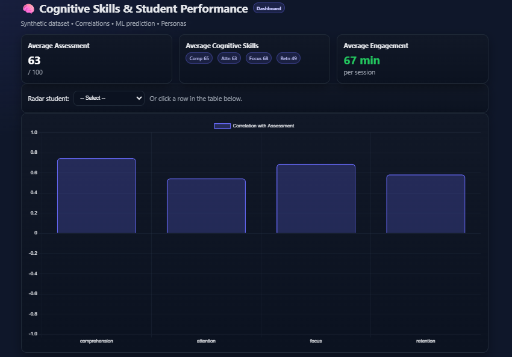
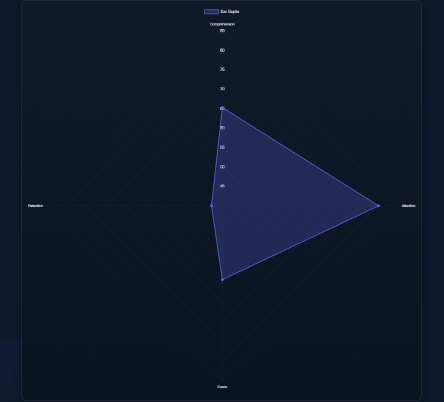
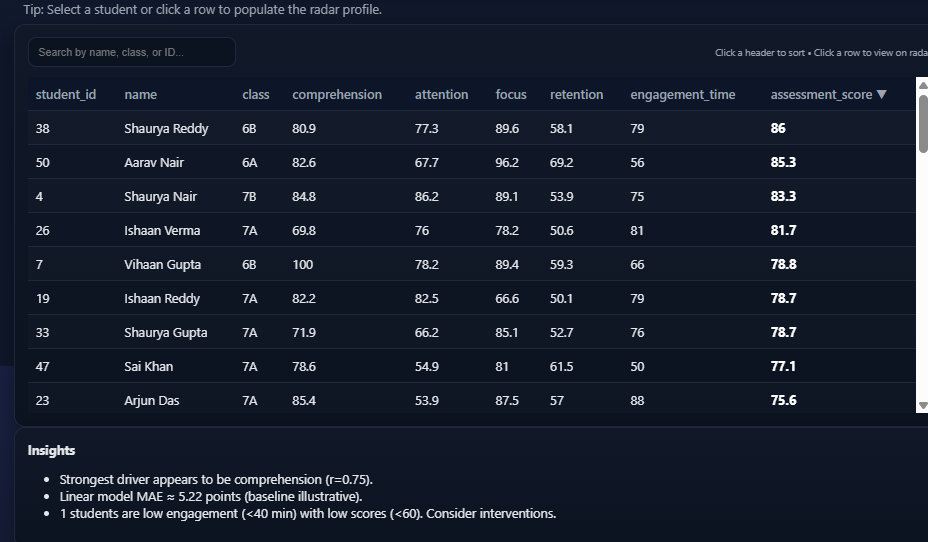

# 🧠 Cognitive Skills & Student Performance Dashboard

This project is an interactive dashboard and analysis pipeline that demonstrates how **cognitive skills** (comprehension, attention, focus, retention, engagement) influence **student performance**.  
It uses a **synthetic dataset** and integrates **data analysis (Jupyter Notebook)** with a **Next.js dashboard** for visualization.

---

## 🚀 Features

- 📊 **Overview Stats** – average scores & cognitive skill levels
- 📈 **Charts** – Bar (skills vs score), Scatter (attention vs performance), Radar (individual student profile)
- 🔍 **Searchable & Sortable Student Table** – filter by name/class, click row to inspect student
- 🤖 **Machine Learning** – simple linear regression to predict `assessment_score`
- 🧩 **Clustering** – students grouped into personas (`Analytical`, `Balanced`, `Hands-on`)
- 💡 **Insights Panel** – automatically generated key findings

---

## 📂 Project Structure

studentsPerformance(Dashboard)/
│
├─ components/ # React components (Stats, Charts, Table)
├─ data/ # Synthetic CSV dataset
├─ lib/ # Analytics utilities (linear regression, kmeans)
├─ notebooks/ # Jupyter Notebook for analysis & ML
├─ pages/ # Next.js pages (main dashboard)
├─ public/data/ # JSON dataset for web app
├─ snapshoots/ # 📸 Screenshots of the dashboard
├─ styles/ # Global CSS
├─ README.md

---

## ⚙️ Installation & Setup

### 1. Clone the repository
git clone https://github.com/Vendikattu/students-performance-dashboard.git
cd students-performance-dashboard

2. Install dependencies
npm install

3. Run locally
npm run dev
Visit http://localhost:3000.

4. Jupyter Notebook (Analysis + ML)
Make sure you have Python 3 & Jupyter installed:

pip install notebook pandas numpy scikit-learn matplotlib
jupyter notebook notebooks/analysis.ipynb

🖼️ Screenshots

- *Overview Stats*  
  

- *RadarChart Plot (Attention vs Assessment)*  
  

- *Student Table*  
  

📊 Deliverables

✅ Jupyter Notebook (analysis + ML model)

✅ Next.js dashboard (stats, charts, table, insights)

✅ GitHub repository (this project)

✅ Deployed Vercel link (shareable)

✅ README with setup instructions & findings

🔮 Insights Example
Strongest driver of performance = attention (highest correlation).

ML model achieves low error (MAE) for predicting scores.

Identified cluster of low-engagement, low-score students for potential interventions.

🌐 Deployment
This project is deployed on Vercel for live access.
👉 Deployed Link (https://students-performance-dashboard.vercel.app/)

📧 Author
Vendikattu Naveen
📩 vendikattunaveen@gmail.com
🔗 https://github.com/Vendikattu

